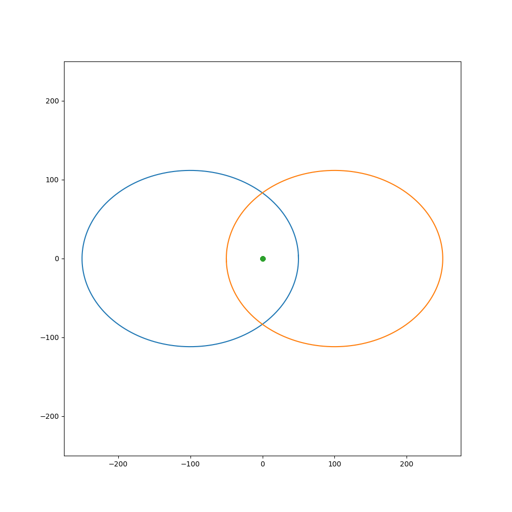

# Gravitational N Body Modelling 2D
Repository for the development of gravitational N body modelling calculations and visualisations.

This repo can be used to run a web app to explore the orbits of various pre-defined N body configurations
(x, y, v<sub>x</sub>, v<sub>y</sub> and mass). Orbit paths can also be plotted or animated using the CLI.

The code makes use of [`scipy.integrate.ode`](https://docs.scipy.org/doc/scipy/reference/generated/scipy.integrate.ode.html) in order to calculate the change in x, y, v<sub>x</sub> and v<sub>y</sub> at each given time step due to the gravitational forces of all other bodies in the system. The integrator used is `dopri835`.

## Running Locally

Install requirements:
```commandline
pip install -r requirements.txt
```

### CLI

Plot orbits for one of the default orbit configurations:
```commandline
python run.py --orbit TWO_LIGHT_ONE_MASSIVE
```

Animate orbits for one of the default orbit configurations:
```commandline
python run.py --orbit TWO_LIGHT_ONE_MASSIVE --animate
```

### Web App

Run the web app using streamlit (https://www.streamlit.io/)
```commandline
streamlit run app.py
```

## Roadmap

- Update web app to display animations of the orbit path
- Update web app to allow for custom N body configurations

## Example Orbits
<table>
  <tr>
    <td>Chaos</td>
    <td>2 Light 1 Massive</td>
    <td>Broucke A 2 [1]</td>
  </tr>
  <tr>
    <td>
      
    </td>
    <td>
      
    </td>
    <td>
      
    </td>
  </tr>
  <tr>
    <td>YIN-YANG 2b [1]</td>
    <td>BUTTERFLY IV [1]</td>
    <td>II.15.A [1]</td>
  </tr>
  <tr>
    <td>
      
    </td>
    <td>
      
    </td>
    <td>
      
    </td>
  </tr>
</table>

[1] Initial starting conditions taken from http://three-body.ipb.ac.rs/. Paper: <i>M. Šuvakov and V. Dmitrašinović,
Three Classes of Newtonian Three-Body Planar Periodic Orbits, Phys. Rev. Lett. 110, 114301 (2013). arXiv:1303.0181.</i>
